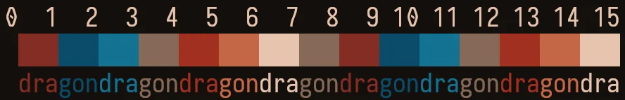

# Wise Dragon
## About
This repository holds ports of the theme Wise Dragon for terminal emulators.
That is a theme with a brown and blue palette.

Here is a preview of its palette:

## Palette
These are the colors used in the theme:

| Name                | ANSI | Hex Code  |
| ------------------- | ---- | --------- |
| Black (background)  | 0    | `#140f0d` |
| Red                 | 1    | `#852d25` |
| Green               | 2    | `#0a4b69` |
| Yellow              | 3    | `#137291` |
| Blue                | 4    | `#856956` |
| Magenta             | 5    | `#a13020` |
| Cyan                | 6    | `#c46747` |
| White (foreground)  | 7    | `#e6c3ae` |

## Copyright
This software is under the BSD-3-Clause license. A copy of the license is
bundled with the source code.
